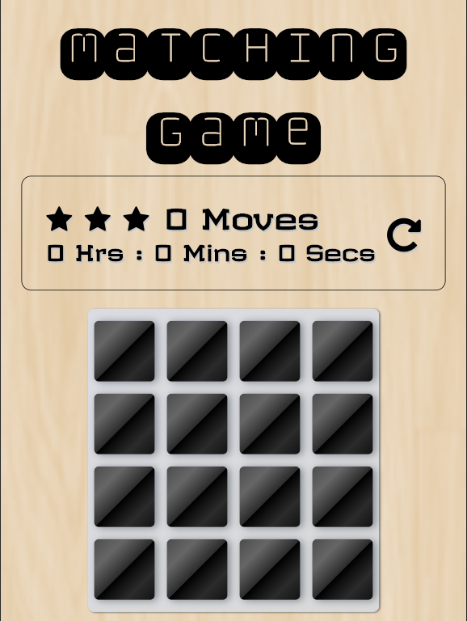

# Matching Game Project

**The Matching Game requires a gamer to match all
the cards on the deck as fast as possible.**

## Table of Contents

* [Instructions] Original Project Instructions(#instructions)
* How to play the game?
* How to install the game?
* How I built the Matching Game?

## Original Project Instructions

The starter project has some HTML and CSS styling to display a static version of the Memory Game project. You'll need to convert this project from a static project to an interactive one. This will require modifying the HTML and CSS files, but primarily the JavaScript file.

To get started, open `js/app.js` and start building out the app's functionality

For specific, detailed instructions, look at the project instructions in the [Udacity Classroom](https://classroom.udacity.com/me).

## How to play?

[Play Online!](https://patel-jenu-1991.github.io/fend-project-memory-game/)

+ Start by clicking on a pair of cards to see if they match
+ try and detect the next match by each consecutive click on a pair of cards
+ Once all the cards have been matched you'll be declared the winner
+ You have to do it quickly like a pro to boost your Memory/Concentration.

## How to install?

+ Download the zip file by clicking the `clone or download` button
+ Extract the zip file, and
+ navigate into the project folder,
+ hit index.html to launch live view.

Clone the repository.
Run the following command at your terminal:
`$ git clone https://github.com/Patel-Jenu-1991/fend-project-memory-game.git`

## How I built the Matching Game?

I began by fidgeting with the skeleton code initially provided as a starting point. Followed by a quick brush through the [Project Ruberic](https://review.udacity.com/#!/rubrics/591/view), a sum of the project
requirements was accumulated. Breaking down each piece of functionality, and sorting it from easy to hard in solution.

Building up grdaually from the basic game functionality to writing my first ever
minimum-requirements timer class in JavaScript. Then followed by a session of
debugging, testing, and experimenting, it's time to add the finishing touches
and a responsive UI. I learned quite a bit of what is possible with pure css to
accomplish animations. There's a lot to experiment about the new CSS3 Animation capabilities. I enjoyed my time on colorzilla about generating some awesome gradients.

I came across this pen by Manuel Pinto which demonstrates how to create a gradient background animation effect and decided to Implement the functionality
in the Desktop version of my Matching Game. I found it funky, I liked it.

After working on all the Project Ruberic requirements, I decided to Implement an
indefinite progress bar modal into the Matching Game's Deck ...just while it's
Loading...

Please excuse my errors for using aside inside of a ul element to create the
progress bar modal and using illegal query strings while importing google fonts.

## Credits

+ The team of instructors at Udacity who put in a tremendous amount of effort to craft the course of a modern day learning experience and also providing me with the starter code.
+ My friends from the JavaScript community (buu and systemfault), for insisting me to use setTimeout over setInterval.
+ Lisa - My mentor at Udacity for providing me with help and support.
+ Manuel Pinto for his pen that demonstrates a pure css animated gradient background.
+ Brunjo @ pexels.com for a variety of progress bar demos.
+ Subtle Patterns for the mobile/tab background texture.
+ References: Google, Stack Overflow, W3Schools, MDN, CSS Tricks, The David Walsh blog, W3 Documentation and the classroom lessons.
